# 📚 LibraTrack

LibraTrack is a Library Management System developed using **JavaFX** and **MySQL**, aimed at simplifying library operations like issuing and returning books, managing inventory, and tracking overdue penalties.

---

## ✨ Features

### 👤 Member

- 🔐 Login/Register
- 📖 Request books to be issued
- 📦 Request returns
- 💰 View total penalties
- 📊 Dashboard showing issued book count and penalties

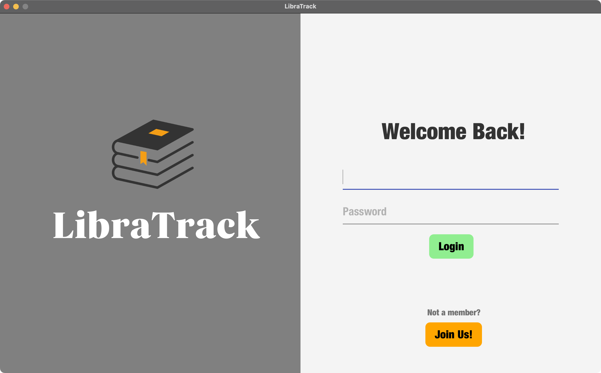
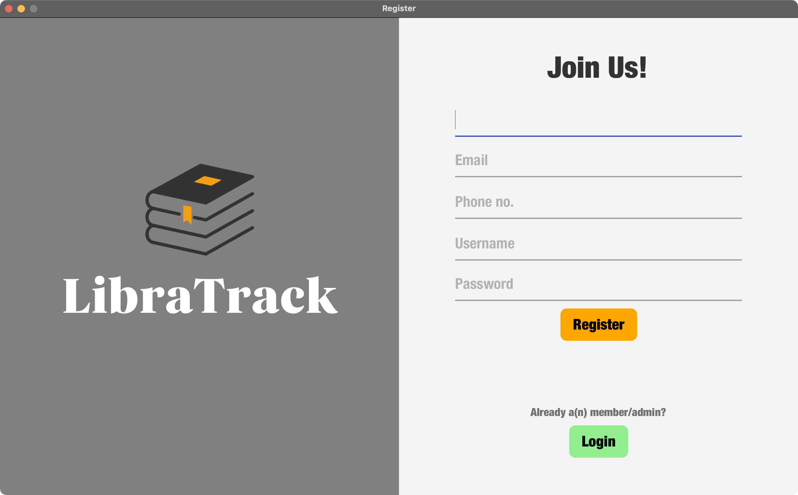
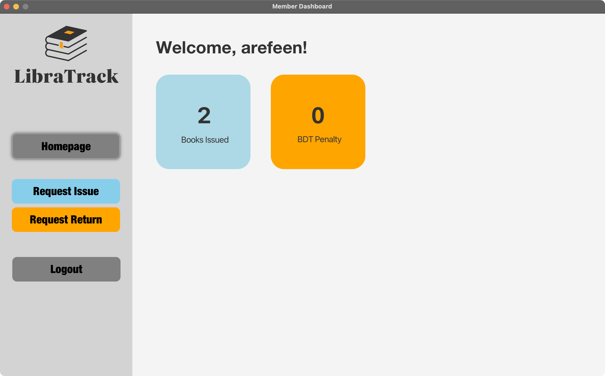
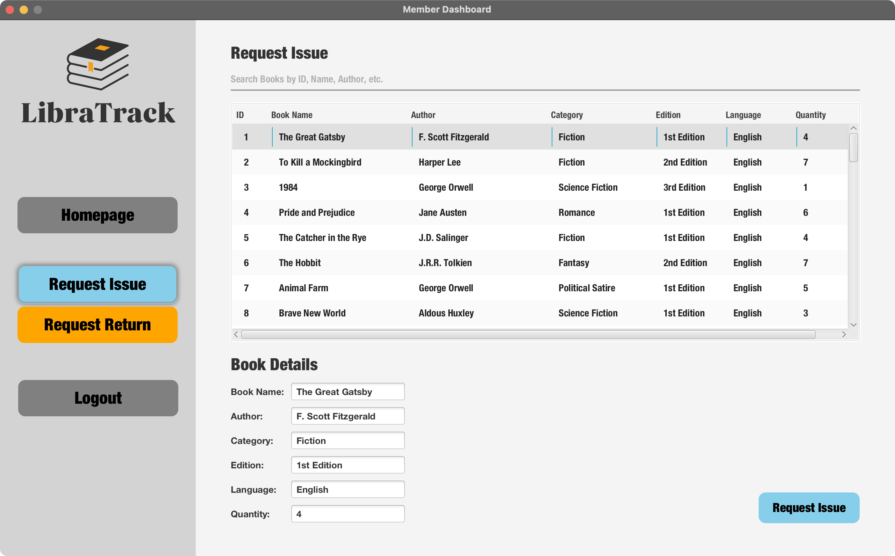
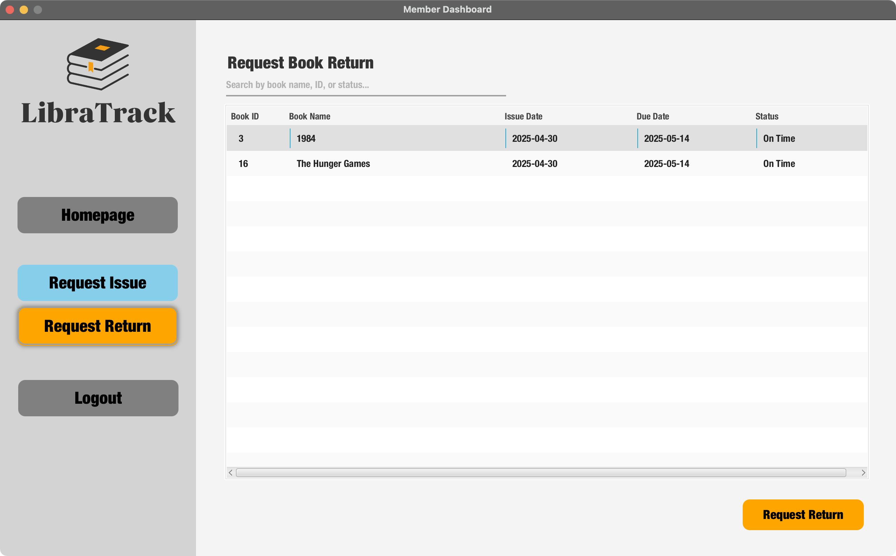

### 🛠️ Admin/Librarian

- 👥 Manage members (add, delete, update)
- 📚 Manage books (add, delete, update)
- 🚀 Approve/issue books without requests
- ⏳ Handle issue and return requests
- 💰 Automatically calculates penalties

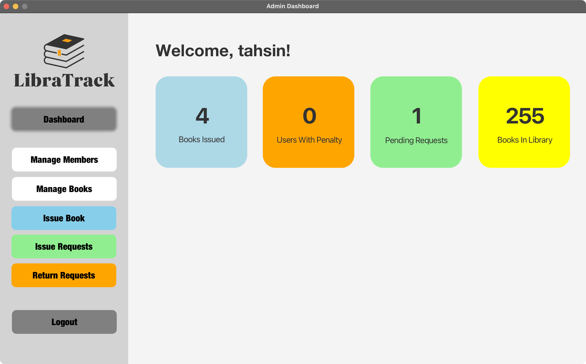
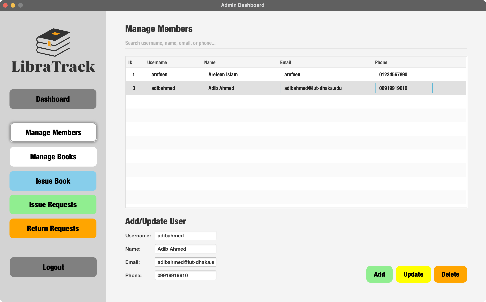
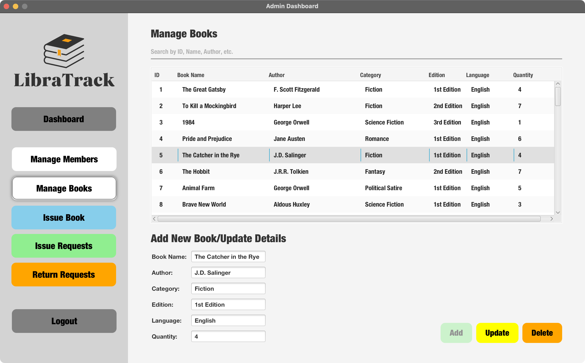
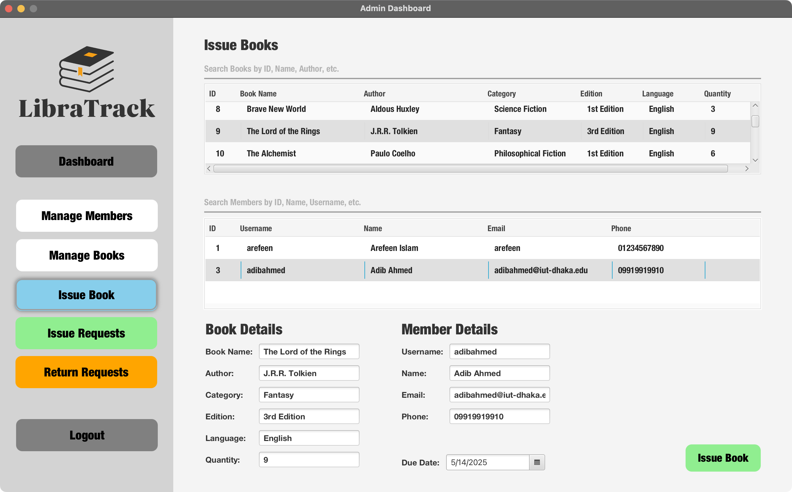
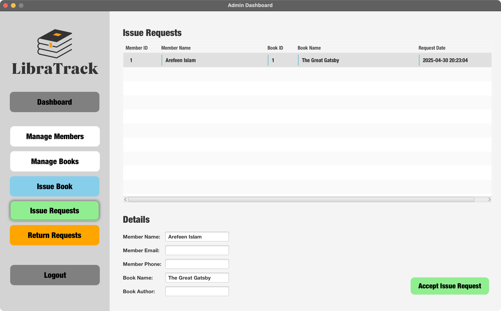
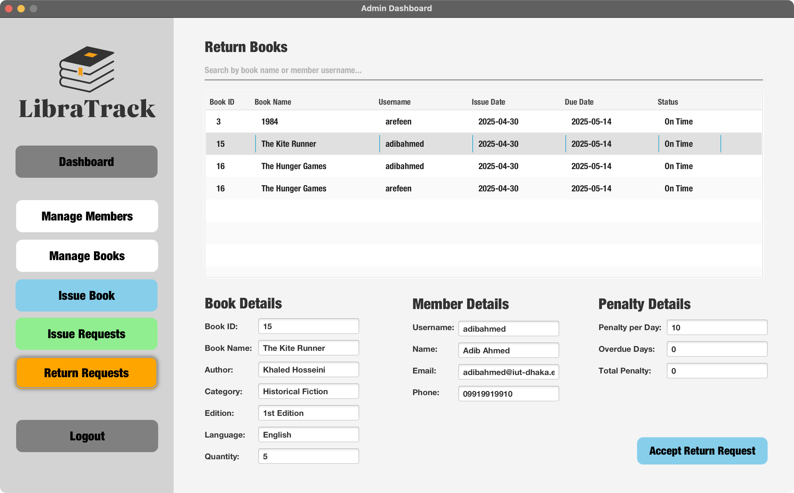

---

## 🛠️ Tech Stack

| Tool              | Purpose                           |
| ----------------- | --------------------------------- |
| **JavaFX**        | GUI framework                     |
| **MySQL**         | Relational database               |
| **Maven**         | Dependency and build management   |
| **IntelliJ IDEA** | IDE with Maven and JavaFX support |
| **GitHub**        | Version control and collaboration |

---

## 🧱 Database Design

The system follows **3NF Normalization** and uses 5 main tables:

- `books`
- `issued_book_details`
- `request_issue`
- `request_return`
- `users`

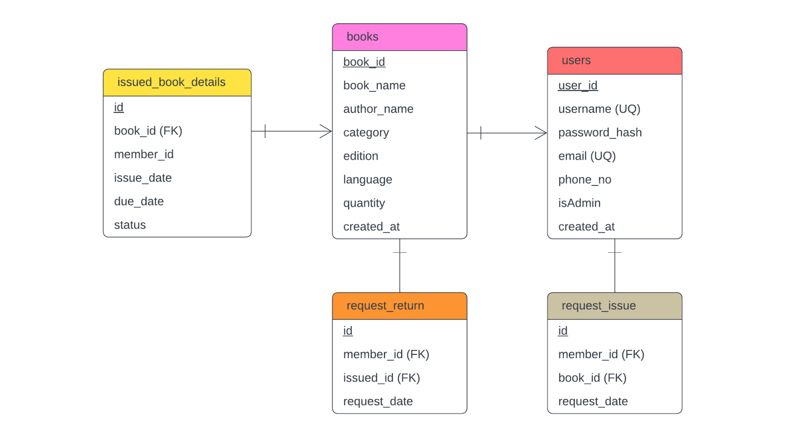

---

## 🚀 Getting Started

### 📦 Prerequisites

- Java 21
- MySQL Server
- IntelliJ IDEA (recommended)
- Maven

### 🛠️ Setup Instructions

1. **Clone the Repository**

   ```bash
   git clone https://github.com/rafiul-arefeen/library-management-system.git
   cd library-management-system
   ```

2. **Setup the Database**

   - Create a MySQL database according to specified schema in the ER diagram.
   - Configure your DB credentials in the Java code if needed.
   - JAR file for connecting to MySQL is provided in the `lib` folder.

3. **Build the Project with Maven**

   ```bash
   mvn clean install
   ```

4. **Run the Application**
   - Open in IntelliJ IDEA.
   - Run the `LibraTrackApp.java` main class.

---

## 📄 License

This project is licensed under the MIT License - see the [LICENSE](LICENSE) file for details.

---

## 👨‍💻 Collaborators

This is made as the final project for CSE 4508: Relational Database Management System Lab.

[Tahsin Bin Reza | 210041106](https://github.com/taxin1)

[Rafiul Arefeen Islam | 210041114](https://github.com/rafiul-arefeen)

[Adib Ahmed | 210041122](https://github.com/AdibOmi)
